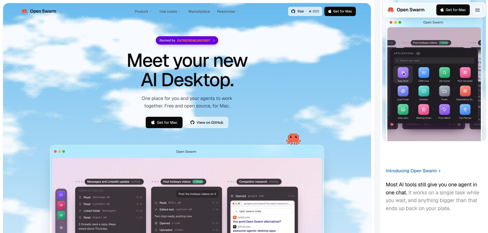

# Open Swarm website

The marketing site for [Open Swarm](https://openswarm.com), the free AI desktop for Mac where you and your agents work together. It is a single page built with React and Vite, and every product shot on it is a coded animation rather than a screen recording, so the scenes stay sharp at any size and loop cleanly on phones.



**Local preview:** http://localhost:4310. Current changes have not been deployed publicly.

## Running it locally

You need Node 20.19 or later on the 20 line, or Node 22.12 or newer (Vite 8 does not support Node 21 or early 22 releases).

```bash
npm install
```

```bash
npm run dev
```

The dev server always starts on http://localhost:4310 (the port is fixed in `vite.config.ts`).

| Command | What it does |
| --- | --- |
| `npm run dev` | Starts the dev server with hot reload |
| `npm run build` | Type checks the project, then builds the static site into `dist/` |
| `npm run preview` | Serves the built `dist/` folder so you can check the production build |
| `npm run lint` | Runs oxlint |

## Stack

- React 19 and TypeScript, bundled by Vite 8
- Tailwind CSS v4. The colour and type values are CSS variables on `:root` in `src/index.css`, exposed to Tailwind through an `@theme inline` block
- `motion` for scroll reveals, tab pills and the header, and Lenis for smooth scrolling
- `simple-icons` for real brand logos (CC0). LinkedIn is no longer in that set, so its mark is drawn by hand in `src/lib/brands.ts`
- Geist, Geist Mono and Manrope from Google Fonts

The frontend builds into static `dist/` assets. Production signups also require the Node API in `api/` and a PostgreSQL database; a static-only deployment cannot collect signups. See [hosted waitlist setup](docs/production-waitlist.md). Asset paths are relative (`base: './'`).

## How the page is put together

`src/App.tsx` lays the sections out in order. The hero sits in its own framed block, and from the Intro down to the Closing each section is separated by a `Seam` divider.

| Section | File | What it shows |
| --- | --- | --- |
| Header | `components/Nav.tsx` | Glass pill with dropdown menus and the waitlist button. On phones the menu opens as a glass accordion inside the pill and the page stops scrolling behind it |
| Hero | `components/Hero.tsx` | The headline, phone waitlist form, and the hero animation (`os/HeroScene.tsx`) |
| Intro | `components/Intro.tsx` | A short statement of the problem Open Swarm solves |
| Capabilities | `components/Capabilities.tsx` | Three cards, each with its own animation: parallel browsing (`os/BrowserScene.tsx`), apps built on request (`os/AppsScene.tsx`) and a swarm working one problem (`os/SwarmScene.tsx`) |
| Use cases | `components/UseCases.tsx` | Four teams (sales, operations, recruiting, research), each with its own animated panel in `components/usecases/` |
| Marketplace | `components/Marketplace.tsx` | Apps that agents use inside Open Swarm, with contextual actions |
| Closing | `components/Closing.tsx` | One compact illustrated Open Swarm footer |

Shared pieces live in `components/ui/` (reveals, section headings, app icons, the sky background) and `lib/` (links, brand logos, the scroll lock).

## How the animations work

Everything in `components/os/` and `components/usecases/` is drawn with ordinary React components. `os/kit.tsx` holds the building blocks, measured from the team's launch videos: the pink and lilac desktop canvas, the dock, agent cards and their step rows, the voice pill, browser windows, app tiles, the app launcher and an animated cursor.

A few rules keep the scenes cheap and predictable:

- **One clock per scene.** `useTimeline(loop, ref, rest)` returns the current time `t` in seconds and loops it. Every scene is a pure function of `t`, so any frame can be reproduced exactly.
- **It only runs when you can see it.** The clock is driven by `requestAnimationFrame`, updates about 30 times a second, and stops completely while the scene is off screen.
- **Reduced motion is respected.** With the system setting on, each scene holds still on its `rest` frame, a moment picked because the scene is full and easy to read (the hero rests with all three agents at work, the use case panels on their finished result).
- **Scenes are designed at a fixed size.** `Stage` lays a scene out once (1280 by 731 for the hero, 520 by 325 for the capability cards) and scales it to fit its container, so it looks the same from a phone to a large monitor.
- **The hero has a phone camera.** When the hero frame is narrower than 640 px (a viewport under roughly 720 px, once the page padding is counted), the whole stage would be too small to read, so `Stage` is given a moving `view` rectangle instead. The frame switches to 4:5 and pans and zooms to follow the action, from the voice pill to each agent card, the launcher and the Daily Brief.

To add a scene, copy one of the capability scenes, keep its `Stage` and `useTimeline` setup, and describe each element's position and opacity as a function of `t` using the timing helpers at the top of `kit.tsx` (`seg`, `ep`, `inOut`, `typed`, `lerp`, `rise`, `popIn`), plus `path` for moving a point, such as the cursor, along keyframes. Then register it in `os/Harness.tsx` so you can preview it on its own.

## Previewing one animation at a time

In development only, you can open any scene or use case panel on a blank page. Production builds strip this out entirely.

| URL | Shows |
| --- | --- |
| `/?scene=hero` | The hero animation |
| `/?scene=browser`, `apps`, `swarm` | The three capability animations |
| `/?scene=uc-sales`, `uc-ops`, `uc-recruiting`, `uc-research` | The four use case panels |
| `/?scene=kit` | A sheet of the kit's components |

Add `&t=4.5` to freeze the clock at 4.5 seconds, which is useful for screenshots, and `&w=390` to render the scene at a set width, for example to check the hero's phone camera. The `t` parameter also freezes the scenes on the full page, but again only in development.

## Deploying a preview

```bash
sh scripts/deploy-preview.sh --prepare-only my-preview-project review
```

This prepares a private, complete source package under `.preview/`, including the waitlist API. It does not contact a hosting account or deploy. After configuring the intended dedicated preview project's PostgreSQL connection and applying the migration, deploy with an explicit project name:

```bash
sh scripts/deploy-preview.sh my-preview-project review
```

The script requires an authenticated Vercel CLI, checks the target's `DATABASE_URL`, and verifies both API functions in the build before publishing. Previews are marked `noindex`. See [complete preview deployment](docs/deploy-preview.md); use [hosted waitlist setup](docs/production-waitlist.md) for the public site.

## Design and copy rules

- Keep the interface black and white. Colour belongs in backgrounds and imagery. The deliberate exceptions are the blue `text-sky` labels (the eyebrows above section headings and the Intro link), and EF's purple on the "Backed by" badge.
- The only orange the site chooses for itself is on the Open Swarm octopus and the EF wordmark. Third-party logos keep their own brand colours, and some of those are orange (Reddit, Hacker News, Product Hunt, HubSpot, Zapier). Don't add orange anywhere else.
- Any third-party tool or integration uses its real logo from `src/lib/brands.ts`, never a generic glyph or initials. Open Swarm's own agents and apps that have no logo may use a line glyph.
- No em dashes anywhere in the copy. Write plain sentences.
- Every animation needs a text description so screen readers get the same story: the `label` on its `Stage` for scenes in `os/`, or the `label` on `PanelRoot` for use case panels. `Stage` does not require one, so it is easy to forget.
- Check the page at phone width after every change. Nothing should scroll sideways.

## Before launch

Some content on the page is a placeholder or a draft and needs the team's sign off:

- [ ] Problem Validator is shown with 6 agents, but its sources differ between places: the animation searches r/startups, r/SaaS, X, Hacker News, Product Hunt and LinkedIn, while the Marketplace card says Reddit, X, Hacker News and review sites. Confirm the count and the sources, then make the Marketplace line, the card logos and the animation's label match.
- [ ] Text Agents, Call Agents and Verbal Hotkeys are listed under "Coming soon" in the Marketplace (names and icons only). Confirm they should be announced. Their draft one-line descriptions in `Marketplace.tsx` are not shown on the page.
- [ ] The quotes in the Problem Validator animation, credited to r/startups, X and Hacker News, and its "38 found" count are illustrative.
- [ ] The Berkeley restaurants and ratings in the browsing animation, and the search results in the hero, are illustrative.
- [ ] The Daily Brief in the hero and apps animations shows a fixed date, "Saturday, Sep 26", and the research panel's papers are dated September with the title "Browser agents, September brief".
- [ ] The use case headings and descriptions are new copy, and the prompts and panel data (companies, candidates, amounts) are invented.
- [ ] Deploy the complete project with the API and migrated database to the real domain. A plain `dist/` upload omits signup storage, and the preview script deliberately marks its target `noindex`.
- [ ] Provide approved, working Privacy and Terms pages using `VITE_PRIVACY_URL` and `VITE_TERMS_URL`. The previous URLs returned 404; unconfigured links are hidden.
- [ ] Connect the intended SMS service before sending the promised early-access notifications. No SMS is currently sent.

## Project layout

```
src/
  App.tsx                page order and smooth scrolling
  main.tsx               entry point, plus the dev-only scene harness
  index.css              Tailwind setup, colour and type tokens
  components/
    Nav.tsx ... Closing.tsx   one file per section
    os/                  product animations and the kit they are built from
    usecases/            the four use case panels
    ui/                  shared pieces
  lib/                   links, brand logos, scroll lock, helpers
public/                  favicon and logo
scripts/deploy-preview.sh
docs/preview.jpg         the screenshot at the top of this file
```

## Local phone waitlist

The waitlist runs locally with `npm run dev` and `npm run preview`. Forms submit to
`POST /api/waitlist` with JSON `{ "phone": "+12025550123", "source": "hero" }`.
US numbers accept ten digits, an optional leading 1, and familiar punctuation.
The country selector accepts other national formats; pasted +country-code numbers override the selection. Shared validation normalizes to E.164,
saves each number once, and returns success only after saving it.

Signups are stored in `.data/waitlist.json` with the phone number, form source, and
signup time. This folder is ignored by Git, blocked from browser file requests,
and is never part of the static build.
Writes are serialized and atomic within one running server process. Run only one
dev or preview server at a time against this file. Existing invalid data causes
requests to fail safely without overwriting the file. No text messages are sent.

Local development remains a prototype. The production API and PostgreSQL migration
are now prepared in `api/`, `server/production-waitlist.ts`, and `sql/001_waitlist.sql`.
They have not been connected or deployed. A static deployment of `dist/` does **not**
include the waitlist API. Follow [hosted setup](docs/production-waitlist.md) before launch. Keep local signup data private and remove test entries when
they are no longer needed.

On Node 24, run the local API tests with:

```bash
node --experimental-strip-types --test server/*.test.ts
```

## Current UI and claims

The hero includes the free offer, the supplied 6,327-person proof count, and a phone signup.
Confirmed signup opens an invite card: three unique friend signups earn priority early access.
The public invite origin defaults to https://openswarm.com. No launch date is claimed.
The unsupported numerical benchmark comparison and 10,000+ integration claim were removed.
See [latest visual decisions and QA](docs/sky-and-signup-refinement.md).
See [functional verification and launch status](docs/functionality-audit.md) for verified flows and outstanding service connections.
