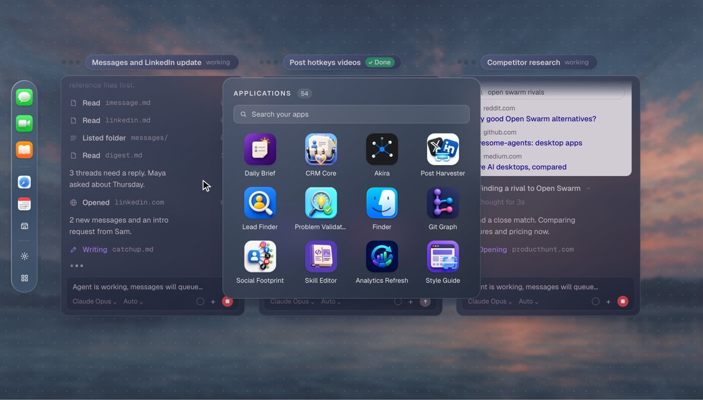
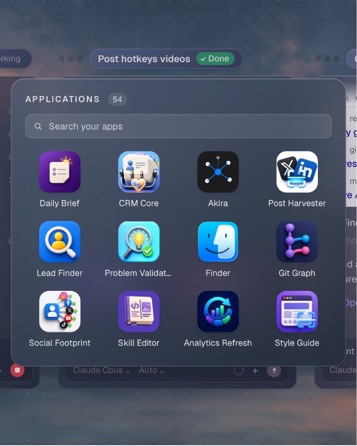

# Open Swarm website

The marketing website for [Open Swarm](https://openswarm.com), a free AI desktop for Mac. Built with React, TypeScript, and Vite, it combines animated product demonstrations with an email waitlist and referral flow.

<table>
  <tr><th>Desktop demo</th><th>Mobile demo</th></tr>
  <tr>
    <td width="68%"></td>
    <td width="32%"></td>
  </tr>
</table>

The current demo uses a slimmer translucent rail, lighter wallpaper, and blue-gray glass panels. The desktop (1280px) and mobile (390px) views show the launcher at 11.8 seconds. See [the glass and app-icon refinement](docs/demo-glass-refinement.md) and [asset provenance](docs/app-assets.md).

<details>
<summary>View the current illustrated footer</summary>


</details>

## What's included

- Responsive landing page with product capabilities, four team use cases, an agent marketplace, and mobile navigation.
- React-based product animations with reduced-motion support, off-screen pausing, and a development scene viewer.
- Email signup with shared form/API validation and duplicate detection.
- Personal invite links and referral progress. Three unique referred signups earn priority waitlist eligibility.
- Local JSON storage for development, plus Node API handlers and PostgreSQL migrations for hosted signups.

The product scenes are visual demonstrations. Marketplace actions lead to the waitlist. Priority eligibility is recorded by the backend; email delivery, email ownership verification, and product account activation are not implemented.

## Quick start

Use Node.js 24 and npm to run the app and its tests.

```bash
git clone https://github.com/Aleskanderai/oswebsite.git
cd oswebsite
npm ci
npm run dev
```

Open [localhost:4310](http://localhost:4310). The development port is fixed; stop another process using it before starting the server.

Local signup works without environment variables or a database. Its first successful signup creates `.data/waitlist.json`. This file contains email addresses and any retained phone signups, is ignored by Git, and is blocked from browser file requests. Run only one development or preview server against this store at a time.

| Command | Purpose |
| --- | --- |
| `npm run dev` | Start the development server with hot reload and the local waitlist API |
| `npm run build` | Type-check the app and server implementation, then build the frontend into `dist/` |
| `npm run preview` | Serve the built frontend with the local waitlist API at `http://localhost:4173` by default |
| `npm run lint` | Run oxlint |
| `node --experimental-strip-types --test server/*.test.ts` | Run email, waitlist, retained phone-record validation, and hosted handler tests |

Run `npm run build` before `npm run preview`. The preview command is for local verification; hosted signups need the API and database described below.

## Configuration

Copy the example only if you need to customize local settings:

```bash
cp .env.example .env.local
```

| Variable | Used by | Purpose |
| --- | --- | --- |
| `VITE_PUBLIC_SITE_URL` | Frontend | Public origin for invite links. Defaults to `https://openswarm.com`; localhost overrides are rejected |
| `VITE_PRIVACY_URL` | Frontend | Approved HTTPS privacy page; the link stays hidden when unset or invalid |
| `VITE_TERMS_URL` | Frontend | Approved HTTPS terms page; the link stays hidden when unset or invalid |
| `DATABASE_URL` | Hosted API | Server-only PostgreSQL connection string, including the provider's TLS settings |
| `TEST_DATABASE_URL` | Test runner | Optional isolated PostgreSQL database for the live integration test |

`VITE_` variables are public and embedded at build time. Restart development after changing them, or rebuild for deployment. Keep database credentials in server-only variables. Setting `DATABASE_URL` does not switch the local Vite waitlist to PostgreSQL.

For end-to-end local referral checks, open `http://localhost:4310/?ref=<code>` using a code returned by the local API. Generated share links use the configured public origin and do not automatically point back to localhost.

## Waitlist and referrals

| Endpoint | Request | Behavior |
| --- | --- | --- |
| `POST /api/waitlist` | JSON with `email`, optional `source`, and optional `referralCode` | Save a new signup or return the existing signup's referral progress |
| `GET /api/waitlist/referral?code=<code>` | A valid share code | Return the current referral count, goal, and priority eligibility |

The form and API trim outer spaces and lowercase accepted email addresses. Dots and plus tags remain intact; provider-specific aliases are not merged. A new signup returns HTTP 201; an existing email returns HTTP 200 without changing its original referral attribution. Success responses contain referral metadata, never email addresses or phone numbers. Phone-only signup requests are no longer accepted.

Each signup receives a random share code. Only new, unique signups attributed to that code count toward the three-referral goal. Repeated submissions and self-referrals do not increase the count. The browser saves share codes for recovery and attribution, not email addresses or phone numbers.

Existing phone records, share codes, and referral attribution are retained. The phone normalizer remains to validate those stored records; it is not part of the current signup form. Email signups are separate identities, and the migration does not infer email addresses or merge them with earlier phone signups.

Local writes are serialized and saved atomically within one server process. Hosted writes use PostgreSQL transactions and uniqueness constraints. The hosted API returns a generic HTTP 503 if storage is unavailable and never falls back to the local JSON file.

See [referral behavior](docs/referral-backend.md) and [hosted database setup](docs/production-waitlist.md) for current implementation details. The [phone input audit](docs/phone-input.md) is historical.

## Deployment

Deploy the **repository root**, including `api/`, `server/`, and dependencies. Uploading only `dist/` serves the page but omits the signup API.

The included hosted entry points target Vercel's Node runtime. Before collecting hosted signups:

1. Configure a PostgreSQL database and deliberately apply [sql/001_waitlist.sql](sql/001_waitlist.sql), then [sql/002_email_waitlist.sql](sql/002_email_waitlist.sql). If `001` is already applied, apply `002` before deploying the email signup API.
2. Set the hosting project's server-only `DATABASE_URL` and the frontend variables above.
3. Build and deploy the frontend together with both API routes.
4. Verify signup, duplicate handling, an invited signup, and referral progress against the deployed endpoints.

Follow [hosted waitlist setup](docs/production-waitlist.md) for migration commands and database access requirements. Deployment does not automatically migrate the database or import local `.data/` records.

### Dedicated preview project

Prepare a complete preview package locally:

```bash
sh scripts/deploy-preview.sh --prepare-only my-preview-project review
```

This requires Python 3 and stages the source under `.preview/` without contacting a hosting account. It excludes local signup data and environment files.

After configuring the intended preview project's database and authenticating the Vercel CLI:

```bash
sh scripts/deploy-preview.sh my-preview-project review
```

The script checks for `DATABASE_URL`, builds the project, verifies both Node API function bundles, and deploys to the **Production environment of the named preview project**. It applies `noindex`, so use a dedicated preview project. See [preview deployment](docs/deploy-preview.md) for scope selection and prerequisites.

## Project structure

```text
api/                        Hosted signup and referral handlers
server/                     Local and PostgreSQL stores, middleware, and tests
sql/                        Initial PostgreSQL schema and email migration
src/
  App.tsx                   Page composition and navigation behavior
  main.tsx                  Entry point and development-only scene viewer
  index.css                 Global styles, typography, and design tokens
  components/
    Nav.tsx ... Closing.tsx  Landing-page sections
    os/                     Product scenes and animation primitives
    usecases/               Sales, operations, recruiting, and research panels
    ui/                     Shared UI, waitlist form, and referral dialog
  lib/                      Email/referral helpers, legacy phone validation, links, brands, and tracking
public/                     Favicon, illustrations, logos, and icon licenses
scripts/deploy-preview.sh   Complete preview packaging and deployment
docs/                       Setup guides, design notes, and verification records
```

The frontend uses React 19, TypeScript 6, Vite 8, Tailwind CSS 4, Motion, and Lenis. Retained phone-record validation uses `libphonenumber-js`; hosted storage uses `pg`. Brand marks come from `simple-icons` and the supplied assets. Typography uses Geist, Geist Mono, and Manrope.

### Editing product animations

The scenes in `src/components/os/` and `src/components/usecases/` use a shared timeline from [kit.tsx](src/components/os/kit.tsx). Scenes render from time `t`, pause when off screen, and hold a representative frame when reduced motion is enabled. `Stage` scales a fixed design canvas, with a moving camera for the hero on narrow screens.

During `npm run dev`, use these query strings to isolate scenes:

| Query | Scene |
| --- | --- |
| `?scene=hero` | Hero product demonstration |
| `?scene=browser`, `?scene=apps`, `?scene=swarm` | Capability demonstrations |
| `?scene=uc-sales`, `?scene=uc-ops`, `?scene=uc-recruiting`, `?scene=uc-research` | Team use-case panels |
| `?scene=kit` | Animation component sheet |

Append `&t=4.5` to freeze a frame and `&w=390` to set the viewer width, for example `http://localhost:4310/?scene=hero&t=4.5&w=390`. The `t` parameter also works on the full page in development. Production builds omit the scene viewer and time override.

To add a scene, reuse `Stage`, `useTimeline`, and the timing helpers from `kit.tsx`, then register it in [Harness.tsx](src/components/os/Harness.tsx).

### Design and copy conventions

- Keep interface controls primarily black and white, with color in imagery and backgrounds. Preserve the established blue section labels and EF purple badge.
- Reserve first-party orange for the Open Swarm octopus and EF wordmark. Third-party logos retain their original colors.
- Use real third-party logos from [brands.ts](src/lib/brands.ts). Demo applications use original artwork from [app-assets.ts](src/lib/app-assets.ts); reserve line icons for utility controls. Daily Brief has its own illustration because it is created within the demo.
- Write plain sentences without em dashes in site copy.
- Give each animation a descriptive `Stage` or `PanelRoot` label and preserve reduced-motion behavior.
- Check phone widths, keyboard navigation, and horizontal overflow after UI changes.

### Tracking

[x-pixel.ts](src/lib/x-pixel.ts) configures the X advertising pixel and tracks clicks on `.dmg` links. It is disabled in Vite development and on local hostnames; it runs in hosted production builds, including hosted previews. Pixel and event IDs are defined in that file.

## Verification and launch notes

Run the build, lint, and test commands above before shipping code changes. The live PostgreSQL integration test is skipped unless `TEST_DATABASE_URL` is supplied. Vite currently reports a large-bundle advisory.

To run the live database test, supply `TEST_DATABASE_URL` through the shell environment or Node's `--env-file=.env.local` option. The plain Node test command does not automatically load Vite environment files. Use an isolated test database with schema-creation permission; the test creates and removes its own temporary schema.

The repository contains the hosted backend implementation. A GitHub push alone does not provision its database or verify a running deployment. See the dated [functionality audit](docs/functionality-audit.md) for recorded browser checks and service setup status.

Items to confirm before a public launch:

- Connect the intended hosting project and migrated database, and verify the hosted signup/referral flow.
- Configure approved Privacy and Terms pages and the intended notification service. Email delivery and ownership verification need separate implementation.
- Confirm the hero's supplied 6,327-person waitlist count, which is currently hard-coded.
- Align Problem Validator's advertised source list with its six-agent demonstration and confirm the three “Coming soon” marketplace items.
- Review illustrative quotes, restaurants, ratings, companies, candidates, amounts, and fixed dates in the demonstrations.

For visual history and asset provenance, see [latest visual decisions](docs/sky-and-signup-refinement.md), [current footer artwork](docs/footer-revision.md), [image assets](docs/image-assets.md), and [icon sources](docs/icon-sources.md).
