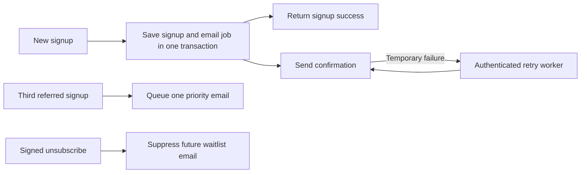

# Open Swarm waitlist emails

The email flow extends the existing email waitlist and preserves its signup response. Sending is **off by default**. No real emails were sent, no live database was migrated, and no provider credentials were configured while building this addition.

## Preview the design

```sh
npm run email:preview
```

Open [localhost:4312](http://localhost:4312). The gallery switches between confirmation and priority emails, desktop and 390px mobile widths, and a simulated dark inbox background. It also includes plain-text versions. The preview server only serves generated files and artwork; it has no delivery transport.

`npm run email:build` exports the [gallery](email-preview/index.html), [confirmation](email-preview/welcome.html), [priority message](email-preview/priority.html), and matching `.txt` files. These are review artifacts with fictional referral codes, inactive unsubscribe tokens, and relative image paths. Production messages are rendered per recipient with absolute HTTPS asset URLs and signed unsubscribe links.

The refined design uses a 560px white reading column, small original octopus wordmark, and one restrained invitation illustration. Helvetica Neue with Segoe UI/Helvetica/Arial fallbacks provides warmer, quieter typography: 28px regular-weight headings (26px on mobile), 15px/24px body text, and 17px secondary headings. A fine divider introduces the three-referral benefit and a compact, left-aligned sharing button. HTML tables and inline styles keep the confirmation, referral offer, and links readable when images are blocked. No external font download is required.

The supplied [LaunchList article](https://getlaunchlist.com/blog/waitlist-email-templates-that-get-opened) and [Crafting Emails examples](https://craftingemails.com/vari-waitlist-email-templates) informed the sequence: confirm the signup, set expectations, offer one clear action. Copy and implementation are original. No purchased template code was used.

### Visual reference lock and artwork

The user-supplied Jev email screenshot anchors the compact, letter-like hierarchy and direct confirmation. Crafting Emails contributes a single primary action and a friendly illustration. Open Swarm contributes the original coral mark and the three-friend reward. The user requested smaller, less cold typography and a sleek design; the refinement removes the oversized celebration panel, slogans, numbered tiles, and dark promotional card. Refero’s live search was unavailable, so its bundled typography guidance and the supplied references informed the build.

`public/media/email/invitations.jpg` is original synthetic artwork generated with Higgsfield GPT Image 2 on September 30, 2026. Its art direction is three translucent vellum invitations, one coral insert, soft daylight, a pure white background, and no text or logos. The 2688 × 1152 source was resized to 1120 × 480 JPEG (about 53KB), displayed at up to 560 × 240. The paper and artwork remain white in the dark preview, with a dark outer canvas and readable footer. The original logo is reused separately, unchanged. The image is decorative; it does not claim that access invitations have already been issued.

## What subscribers receive

| Trigger | Subject | Content and action |
| --- | --- | --- |
| New saved email signup while delivery is enabled | You're on the Open Swarm waitlist | Confirms the saved spot and explains that access will arrive by email. “Share your invite” opens a prepared email draft containing the personal referral URL; the same URL is visible for copying. |
| Third unique referred signup | You've unlocked priority early access | Confirms the existing three-referral milestone. Explains that the actual invitation will arrive separately. Links back to the product section. |
| Duplicate signup | No new email | Returns existing referral progress without changing attribution, resending, or undoing an opt-out. |
| Unsubscribe | No additional confirmation email | Suppresses future waitlist messages while retaining the saved signup and referral history. |

The flow does not invent a launch date, queue position, first name, or ready-to-use account. It does not implement double opt-in, account activation, or an automatic launch campaign. Later invitations should be sent only once access is actually ready.



## Activate delivery

1. Choose the sender and reply-to address, verify the sending domain with Resend, and provision its server API key. The application does not assume a sending identity from the website domain.
2. Apply migrations in order to the intended PostgreSQL database. If 001 and 002 are already installed, apply only the new migration:

   ```sh
   psql "$DATABASE_URL" -v ON_ERROR_STOP=1 -f sql/003_waitlist_email_delivery.sql
   ```

   Migration 003 adds private opt-out metadata and the durable queue. It is additive and rerunnable. It does not enqueue existing contacts or import local signup data. Requests and deploy scripts never apply migrations automatically.

3. Deploy the repository root with all four API functions and the public email artwork. Confirm that the canonical public domain serves `/media/logo-256.png`, `/media/email/invitations.jpg`, the referral landing page, and `/api/waitlist/unsubscribe`.
4. Configure the following **server-only** settings in the hosting environment. Keep them out of `VITE_` variables and Git:

   | Variable | Value |
   | --- | --- |
   | `DATABASE_URL` | Existing private PostgreSQL connection with provider TLS settings |
   | `RESEND_API_KEY` | Sending API key for the verified domain |
   | `WAITLIST_EMAIL_FROM` | Approved sender, optionally `Open Swarm <address@verified-domain>` |
   | `WAITLIST_EMAIL_REPLY_TO` | Optional monitored reply address |
   | `WAITLIST_EMAIL_PUBLIC_URL` | Canonical HTTPS site URL; keep aligned with `VITE_PUBLIC_SITE_URL` |
   | `WAITLIST_EMAIL_SECRET` | Independent random secret of at least 32 bytes for signed unsubscribe links |
   | `CRON_SECRET` | Separate random secret of at least 32 bytes for worker authorization |
   | `WAITLIST_EMAIL_POSTAL_ADDRESS` | Approved business mailing address to display in the footer, when supplied |
   | `WAITLIST_EMAIL_ENABLED` | Set to `true` only after setup is complete |

5. Configure an authenticated schedule to call `GET /api/waitlist/email-worker` with `Authorization: Bearer <CRON_SECRET>`, preferably every 1–5 minutes on a hosting plan that supports that cadence. No schedule is installed by this repository. The route also accepts authenticated POST requests for deliberate queue draining. Each invocation handles at most five messages; signup starts a background attempt for up to two messages after the response. Monitor queue age and increase worker frequency if signups exceed this capacity.
6. Redeploy or restart after changing environment settings. Verify a reserved test signup and the third-referral milestone using addresses you control, inspect the received email in target inbox clients, and verify unsubscribe before collecting live signups with delivery enabled.

Disabled or incomplete delivery configuration preserves the existing signup behavior and does not enqueue emails. There is no historical backfill when delivery is later enabled. Local Vite development and preview signups continue to use the local JSON store and never send emails.

Keep the database and signing secret available after disabling sends so existing unsubscribe links keep working. Rotating that secret invalidates previously issued links; this implementation does not keep a key history.

## Delivery and failure behavior

With valid delivery configuration, the signup and welcome job commit together. A failed queue write rolls back the signup instead of losing its email. Inviter row locking serializes concurrent referral increments, and a unique event constraint allows only one welcome and one priority job per signup. Legacy phone contacts can still contribute referral progress but cannot receive email.

Workers use row locks, expiring leases, and lease tokens so competing workers do not finalize one another's jobs. Before sending, the exact recipient, rendered payload, and hash are saved. Retries reuse that payload and the same provider idempotency key. Transient failures receive bounded backoff; permanent provider errors stop retrying.

There are at most eight attempts, and retries stop 23 hours after the first attempt, inside Resend's documented [24-hour idempotency window](https://resend.com/docs/dashboard/emails/idempotency-keys). This deliberately favors avoiding duplicates after an uncertain send. Do not reset an expired job and resend blindly: check the provider record first. A stalled schedule can leave a job pending until the next invocation, which then enforces the retry deadline.

The `sent` status means the provider accepted the message, not that an inbox received or opened it. Delivery/bounce monitoring uses the provider dashboard; webhook-based delivery analytics and open tracking are not implemented. Worker responses contain counts and generic errors, never recipient addresses or provider error bodies. The private outbox stores recipients inside message payloads, so apply the same data retention and access policy as the signup table.

Unsubscribe URLs use an HMAC signature; knowing a public referral code is insufficient to opt someone out. GET shows a confirmation page without changing preferences, so ordinary link scanners cannot unsubscribe a person. POST performs the opt-out and supports the `List-Unsubscribe-Post` one-click header. Pending work is cancelled and workers recheck preferences before sending. An email already handed to the provider may still arrive after an opt-out.

Implementation references: [Resend send API](https://resend.com/docs/api-reference/emails/send-email), [Vercel background work](https://vercel.com/docs/functions/functions-api-reference/vercel-functions-package), and [Gmail CSS support](https://developers.google.com/workspace/gmail/design/css).

## Verification

```sh
npm run build
npm run lint
node --experimental-strip-types --test server/*.test.ts
```

The September 30 verification passed 53 tests, including the embedded SQL test, with the live PostgreSQL suite explicitly skipped. The production build passes; lint reports only the existing scene warnings.

Tests cover rendering and escaping, HTML/plain-text parity, configuration gating, provider failure classification, signup response preservation, worker authentication, signed opt-out, transaction rollback, duplicate suppression, referral milestones, immutable retry payloads, lease recovery, and the retry deadline.

An isolated PGlite test executes the actual migrations and queue SQL with synthetic data. To run it, set `PGLITE_TEST_MODULE` to an installed PGlite module path and run the same test command. The optional `TEST_DATABASE_URL` suite uses a disposable schema in a real PostgreSQL instance to exercise multiple connections. Neither test reads the private local signup store.

Browser previews verify layout and controls, not actual Gmail, Apple Mail, or Outlook rendering. Dark-mode previews force the optional media rules for review; real clients can recolor email differently. Live inbox delivery, sender-domain setup, hosted bundling, and the real multi-connection PostgreSQL suite remain activation checks.
